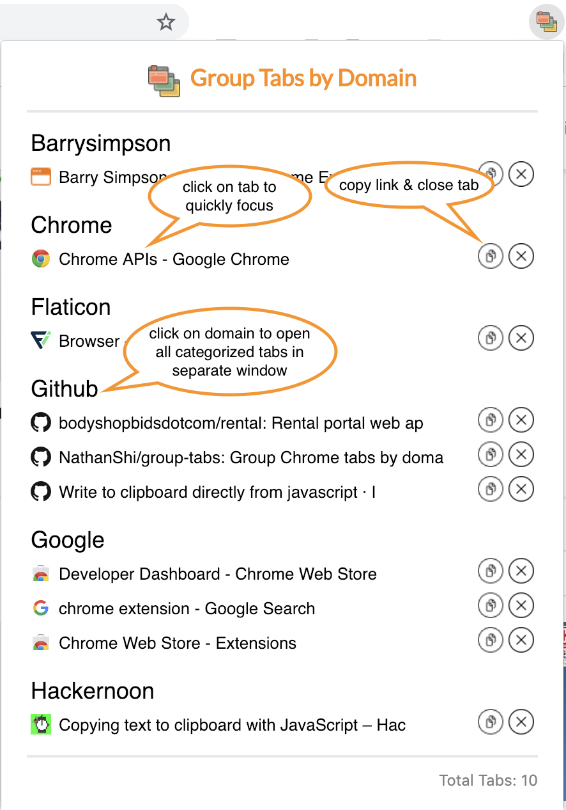

# Categorize-tabs
Group Chrome tabs by domain. A Chrome Extension.

## Getting Started

To install group-tabs chrome extension, you can:

- Go to [Chrome Web Store - categorize tabs](https://chrome.google.com/webstore/detail/categorize-tabs/oefogamggbofaeonfmkigobeflejjgei?hl=en) and click on 'Add to Chrome'
- Clone this repo
  - `git clone https://github.com/NathanShi/group-tabs.git`

  - open `chrome://extensions/`

  - enable developer mode on top right

  - click on _Load unpacked_ button on top left and select this directory

## Usage

## Next steps

- Allow option for categorize tabs across all windows
- Add search bar
- Allow drag & drop functions
